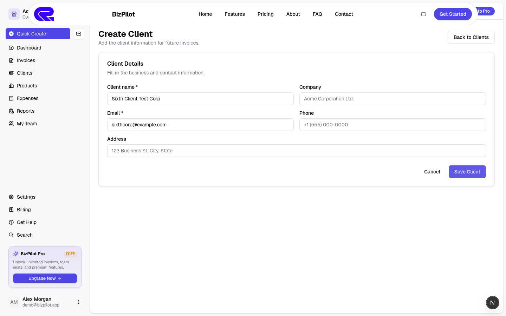
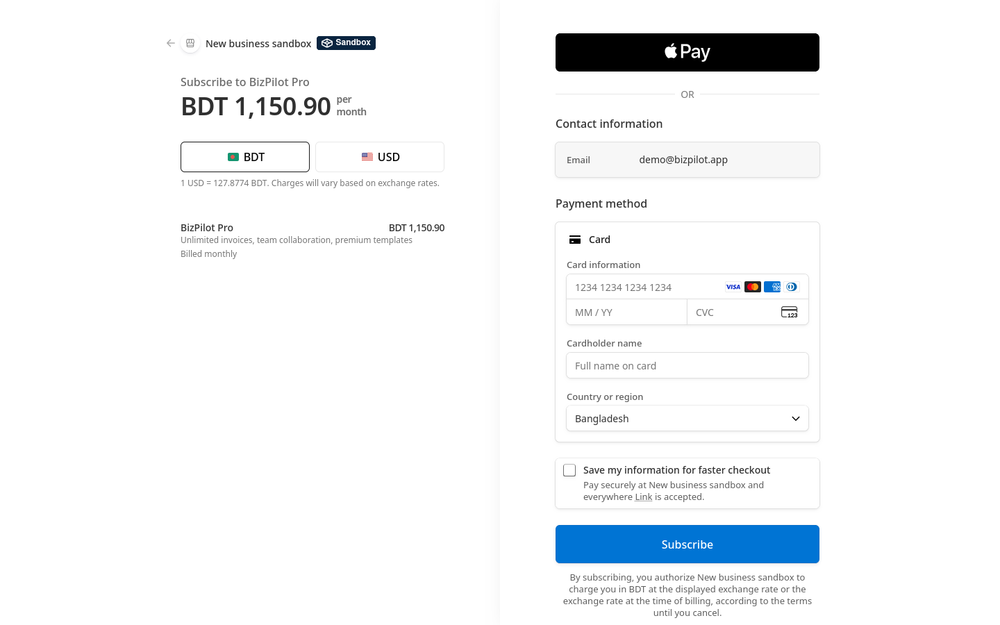
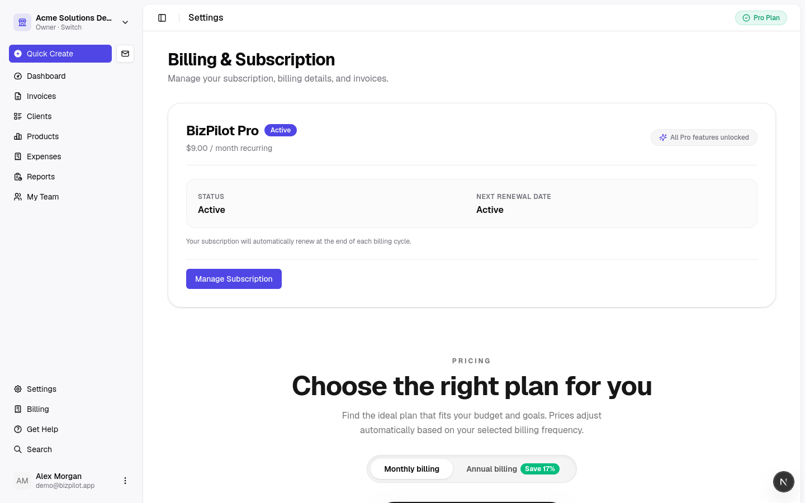
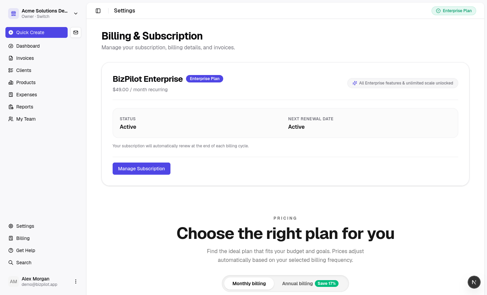

# BizPilot — Mini-ERP SaaS

Monorepo for BizPilot: a subscription mini-ERP for small businesses
(invoicing, clients, inventory, expenses, reports, teams).

## Billing and plan controls

BizPilot enforces plan limits in the product, guides users to the appropriate
upgrade path, and uses Stripe Checkout for subscriptions.

| Free-plan usage limit | Upgrade checkout |
|---|---|
|  |  |

| Active Pro subscription | Active Enterprise subscription |
|---|---|
|  |  |

Additional plan-limit, feature-lock, checkout, and upgrade-flow captures are
kept in [`docs/assets/screenshots/billing/`](docs/assets/screenshots/billing/).

## Layout

| Path | Purpose |
|---|---|
| `docs/` | Product & engineering documentation (SaaS readiness report, QA requirements analysis, Django migration plan) |
| `docs/assets/screenshots/billing/` | Product screenshots for billing, checkout, plan limits, and entitlement flows |
| `backend/` | Django 5/6 + DRF API server (scaffolded with cookiecutter-django) |
| `cookiecutter-config.yaml` | Reproducible cookiecutter-django scaffold configuration |

## Backend quickstart

See `backend/README.md` for the full guide. Short version (Docker):

```bash
cd backend
docker compose -f docker-compose.local.yml up
```

Local (non-Docker) smoke check:

```bash
cd backend
uv sync
env USE_DOCKER=no DATABASE_URL=sqlite:///db.sqlite3 uv run python manage.py migrate
env USE_DOCKER=no DATABASE_URL=sqlite:///db.sqlite3 uv run pytest
```

Note: the bundled `sites` data migration is Postgres-specific; on SQLite fake it
with `uv run python manage.py migrate sites --fake`. Production uses PostgreSQL
via Docker Compose (Postgres 16 + Redis + Mailpit).

## Internationalization (English + বাংলা)

- Supported languages are declared in `config/settings/base.py` (`LANGUAGES`).
- `LocaleMiddleware` resolves the language from cookie / `Accept-Language`.
- Source strings are marked in templates (``) and Python (`gettext_lazy`).
- Bangla catalog: `locale/bn/LC_MESSAGES/django.po` (compiled `.mo` is committed so
  CI/production need no gettext).

After adding or changing translatable strings:

```bash
python manage.py makemessages -l bn --ignore=.venv/* --ignore=staticfiles/*
# ...fill in translations in locale/bn/LC_MESSAGES/django.po...
python manage.py compilemessages
```

Users switch language via the navbar selector (POSTs to `/i18n/setlang/`, the
Django `set_language` view).

## Admin theme (django-unfold)

The admin uses [django-unfold](https://unfoldadmin.com). `"unfold"` is listed
before `django.contrib.admin` in `INSTALLED_APPS`, and admin classes inherit
`unfold.admin.ModelAdmin` (e.g. `UserAdmin(auth_admin.UserAdmin, ModelAdmin)`).
Registrations/fieldsets structure is unchanged — only base classes differ.

## Milestones
 
Follows `docs/DJANGO_MIGRATION_PLAN.md` §8. Current status:
- **M1: Scaffold** — Done (CI ruff + mypy + pytest, Docker Compose, OpenAPI).
- **M2: Authentication & Users** — Done (SimpleJWT, profiles, OAuth, password reset).
- **M3: Organizations & RBAC v2** — Done (Fixed permission catalog, system & custom roles, memberships, invites).
- **M4: Domain APIs (ERP Core & Reports)** — Done (Clients, products, invoices, payments, expenses, auto-numbering, stock management, analytics).
- **M5: Billing & Subscriptions** — Done (Stripe checkout/portal/webhooks, tiered entitlements, usage metering).
- **M7: AI Platform** — Done (Provider gateway, line item generation, conversational assistant, token metering).
- **M8: Transactional Email & PDF** — Done (Branded HTML templates, ReportLab PDF generator, Celery async dispatch).
- **M9: Data Migration & Production Hardening** — Done (Supabase SQL/live migration, reconciliation suite, tenant isolation & security verification).
