# BizPilot — Mini-ERP SaaS

Monorepo for BizPilot: a modern, subscription-based mini-ERP tailored for small businesses, agencies, and freelancers. BizPilot unifies invoicing, client management, product inventory, expense tracking, multi-currency reporting, team collaboration with RBAC, and AI-powered business analytics into a single platform.

## Application Showcase and Feature Tour

BizPilot includes a high-performance Next.js frontend integrated with a robust Django 5/6 REST API backend, enforcing multi-tenant isolation, tiered subscription entitlements, and role-based permissions. Below is a comprehensive walkthrough of the application interfaces with architectural and operational details.

---

### 1. Landing Page and Hero

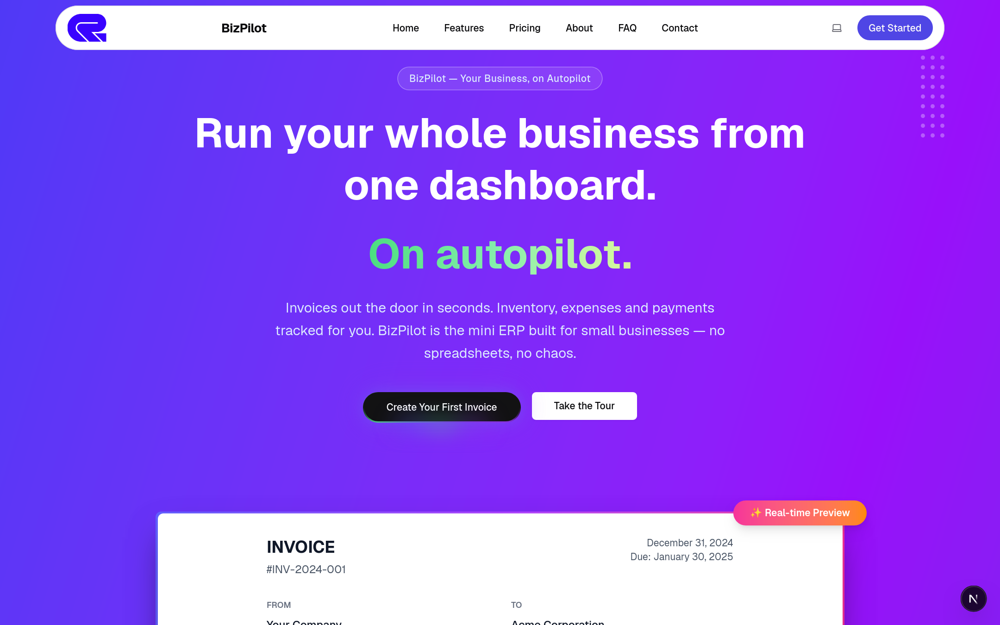

**Description:**
The landing page introduces the BizPilot SaaS platform with a modern, dark-mode design system. It highlights the core value propositions: fast invoice creation, automated payment reminders, real-time revenue analytics, and the conversational BizPilot AI assistant. The hero includes primary calls-to-action to get started for free or book a live product demo, backed by trust badges and interactive platform highlights.

---

### 2. Pricing Tiers and Plan Matrix

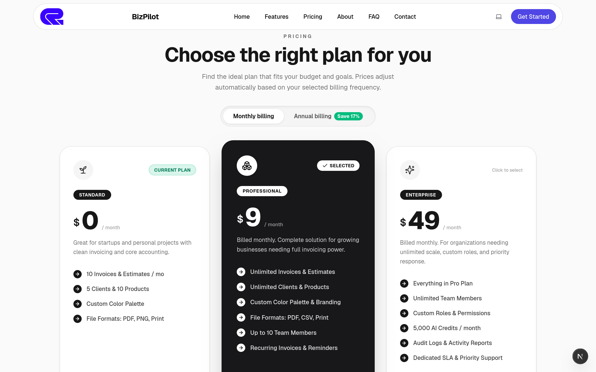

**Description:**
A transparent pricing comparison showcasing BizPilot's three subscription tiers:
- **Free ($0/month):** Entry plan supporting up to 3 clients, 5 invoices per month, 1 user seat, standard PDF exports, and community support.
- **Pro ($9/month or $90/year):** Professional tier offering up to 50 clients, 200 invoices per month, 5 team seats, automated payment reminders, custom branding, and 50 AI assistant queries per month.
- **Enterprise ($49/month or $490/year):** Unlimited tier providing unlimited clients, unlimited invoices, unlimited team seats, priority 24/7 support, dedicated account management, custom domain configuration, and unlimited AI assistant queries.

Features an interactive monthly/yearly billing toggle displaying annual discount savings and direct checkout triggers.

---

### 3. Authentication and Access Gateway

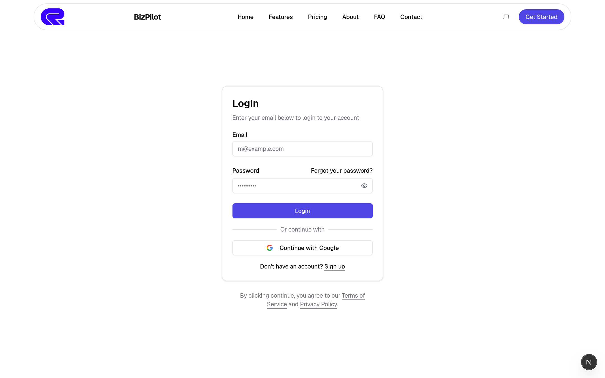

**Description:**
Secure entry gateway providing dual authentication methods: standard email/password authentication and Google OAuth single sign-on (SSO). The authentication pipeline issues JWT access and refresh tokens with automated token refresh rotation, multi-tenant workspace context attachment, and session security verification.

---

### 4. Executive Financial Dashboard

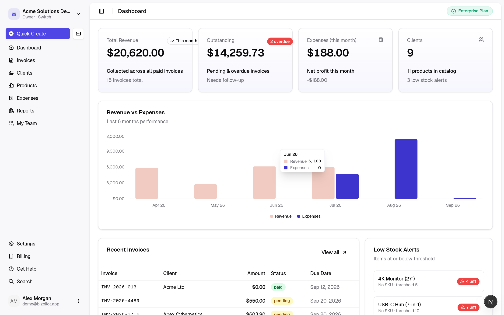

**Description:**
The operational command center displaying key financial metrics and high-level business indicators in real time:
- **Total Revenue ($20,600.00):** Aggregated revenue with percentage growth compared to the previous period.
- **Total Expenses ($3,450.00):** Logged operational outflows across all active expense categories.
- **Net Profit ($17,150.00):** Real-time bottom-line profit calculated dynamically from recognized revenues and expenses.
- **Outstanding Receivables ($12,000.00):** Total outstanding balance across unpaid and pending invoices.
- **Revenue Analytics:** Monthly bar charts comparing revenue vs. operational costs.
- **Invoice Pipeline:** Visual breakdown of drafts, pending payments, paid collections, and overdue notices.
- **Quick Action Triggers:** Shortcuts for creating invoices, registering clients, and recording expenses directly from the dashboard.

---

### 5. Invoices Management and Status Lifecycle

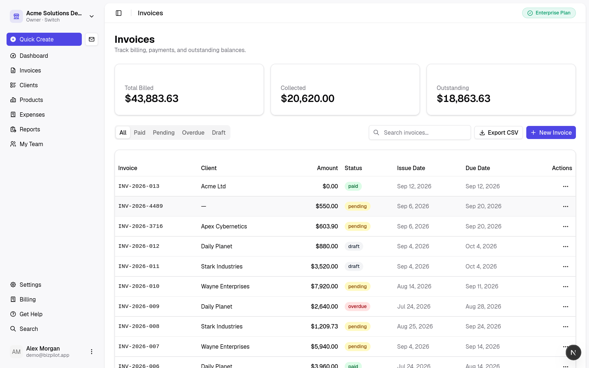

**Description:**
A full-featured data table managing organizational invoices across their entire lifecycle. Features include:
- Tabbed status filtering: All, Draft, Pending, Paid, and Overdue.
- Sequential numbering with configurable prefixes (e.g., INV-001, INV-002).
- Dynamic client attribution, issue dates, due dates, and formatted currency values.
- Color-coded status badges for instant readability.
- Row action menus allowing users to view details, download branded PDFs, send invoice emails via Celery, or record customer payments.

---

### 6. Detailed Invoice View and Payment Recording

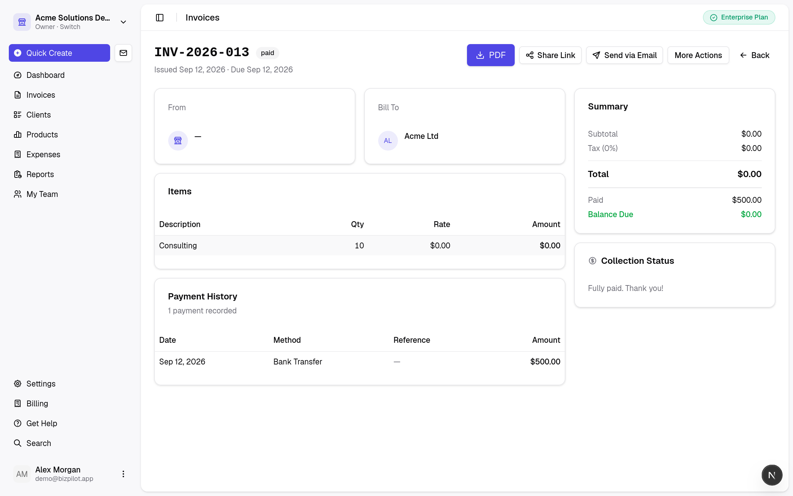

**Description:**
Comprehensive view of a specific invoice record showing sender details, recipient client information, payment terms, and status. It presents a complete line-item breakdown with quantities, unit prices, applied tax rates, subtotal, and total due. Provides top-bar actions to trigger instant PDF generation, send transactional email notices to the client, or open the payment recording modal to log partial or full payments.

---

### 7. Interactive Invoice Authoring and Calculation Builder

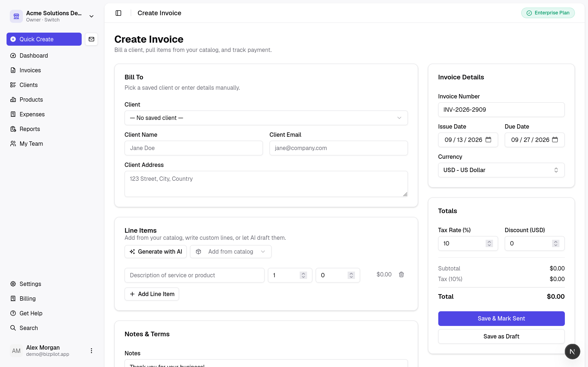

**Description:**
Intuitive invoice authoring studio designed for speed and error-free calculation:
- Auto-generated sequential invoice numbers linked to organization sequence generators.
- Dropdown client selection with quick-add client capabilities.
- Configurable issue date and payment due date pickers.
- Dynamic line item editor with real-time reactive calculation of line totals, aggregate subtotals, tax percentages, and final balances.
- Memo and terms fields for bank account details, wire instructions, and custom client notes.

---

### 8. Client Directory and CRM Management

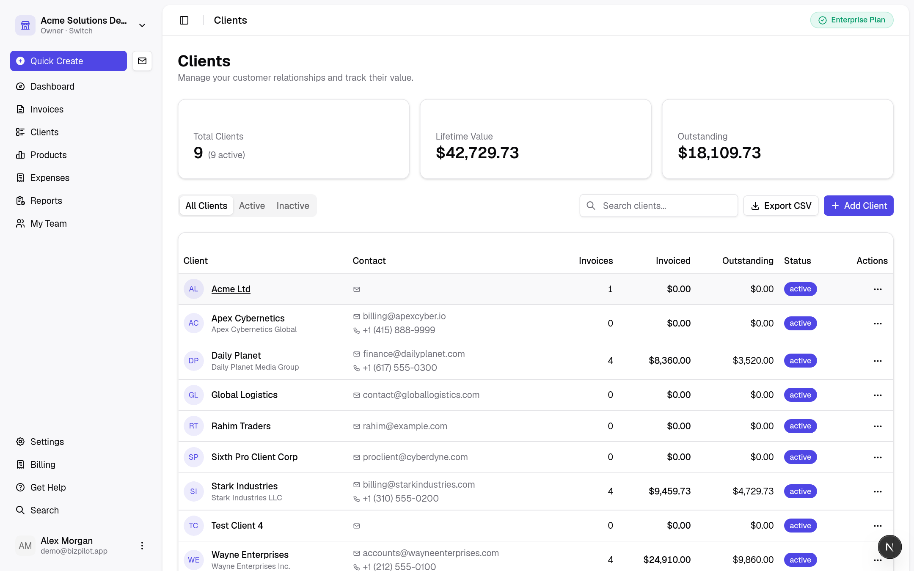

**Description:**
Central client directory providing relationship and billing history tracking for all customers. Lists company names, primary contact persons, email addresses, phone numbers, and active billing statuses. Automatically enforces plan limits (such as the 3-client quota on Free plans) and presents non-disruptive upgrade triggers when limits are reached.

---

### 9. Product and Inventory Catalog

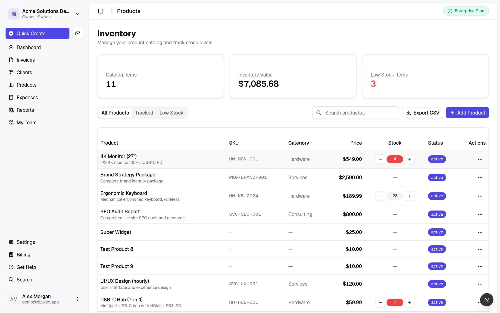

**Description:**
Product and inventory catalog tracking billable services and physical goods. Displays unique SKU codes, unit selling prices, category tags, and real-time inventory counts. Low-stock badges automatically flag items approaching exhaustion to prevent stockouts and assist reordering.

---

### 10. Expense Ledger and Operational Outflow

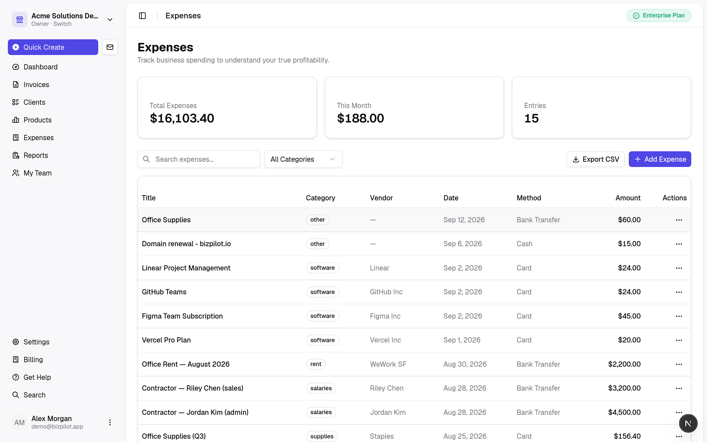

**Description:**
Comprehensive expense tracking ledger recording organizational disbursements. Users can capture expense dates, descriptions, categories (e.g., Software Subscriptions, Office Supplies, Travel, Utilities), payment methods (Credit Card, Bank Transfer, Cash), and total amounts. These entries automatically feed into net profit calculations and financial analytics.

---

### 11. Financial Reports and Ask BizPilot AI Assistant

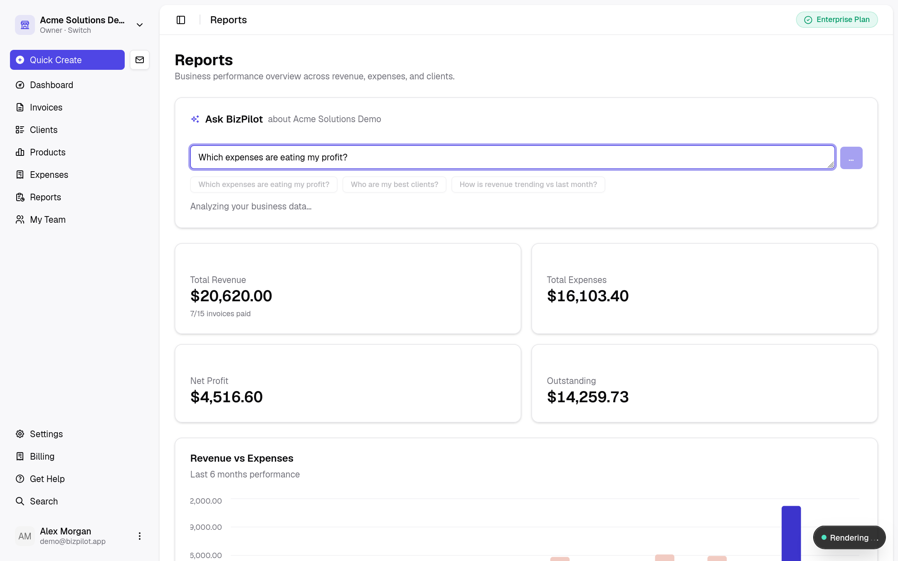

**Description:**
Advanced reporting center combining revenue trend visualizations with the Ask BizPilot AI assistant:
- **Revenue vs. Expenses:** Visual comparison of financial flow across billing cycles.
- **Natural Language Business Intelligence:** Users can query the assistant in plain English (e.g., *"Summarize our revenue, net profit, and any high-value overdue invoices"*).
- **Structured AI Insights:** The backend AI gateway analyzes real-time ERP data to return executive summaries, cash flow health assessments, and actionable recommendations with zero guesswork.

---

### 12. Team Collaboration and Role-Based Access Control

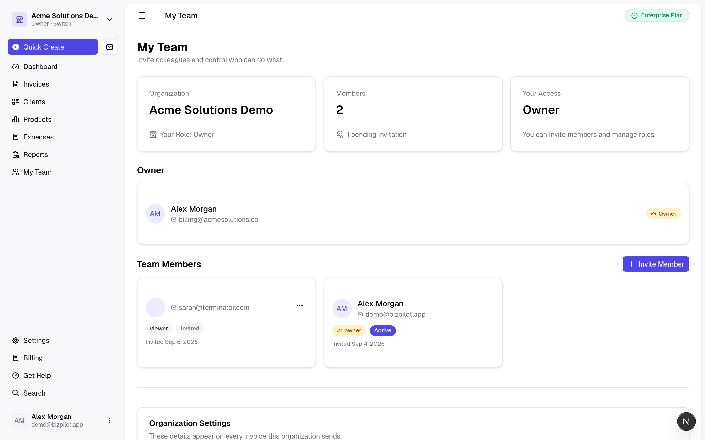

**Description:**
Collaborative team workspace administration allowing organization owners to manage colleagues and access privileges:
- Granular role assignment: Owner, Admin, Member, and Viewer.
- Seat allocation tracking enforced according to active subscription plan tiers (e.g., 1 seat on Free, 5 seats on Pro, unlimited on Enterprise).
- Pending invitations table with cancellation and resend capabilities.

---

### 13. Subscription Management and Usage Quotas

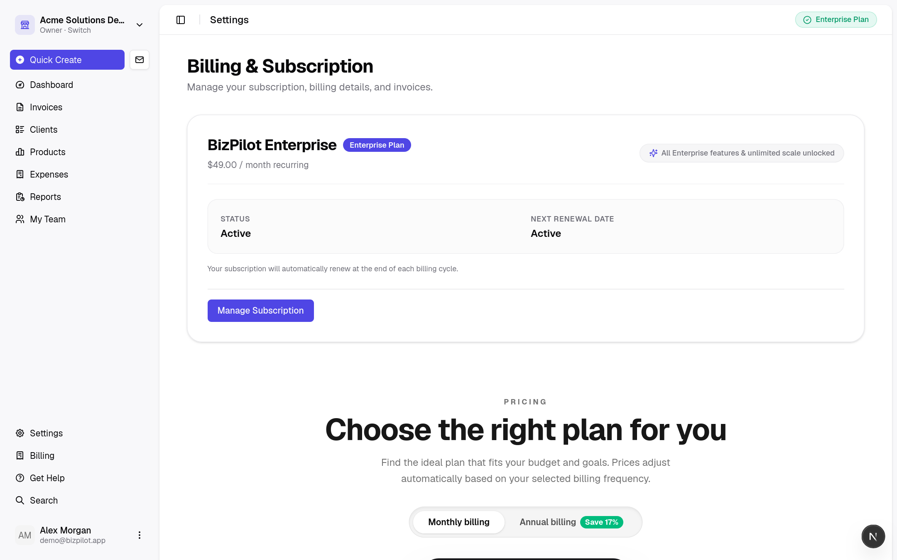

**Description:**
Self-service billing console providing full transparency into organizational subscription status:
- Active tier status badge (Free, Pro, Enterprise) and billing period interval.
- Real-time usage meters displaying consumption against plan allowances: Client Count, Monthly Invoices, Team Seats, and AI Query Tokens.
- Seamless gateway to Stripe Checkout and Stripe Customer Portal for managing payment methods, upgrading subscriptions, and retrieving historical tax invoices.

---

### 14. Global Search and Quick Navigation

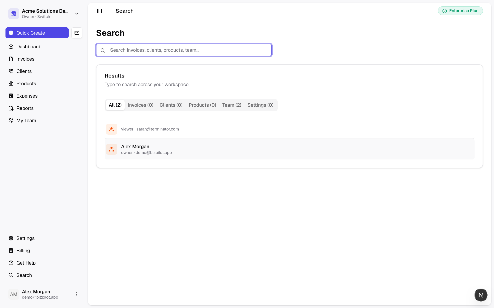

**Description:**
Keyboard-accessible global omnibar search dialog (Command/Ctrl + K) enabling rapid navigation across the application. Provides instant fuzzy search matching across clients, invoices, products, expenses, and system settings without page reloads.

---

## Billing and Plan Controls

BizPilot strictly enforces plan limits in the product, guides users along the appropriate upgrade path, and uses Stripe Checkout for subscriptions.

| Free-Plan Usage Limit | Upgrade Checkout |
|---|---|
|  |  |

| Active Pro Subscription | Active Enterprise Subscription |
|---|---|
|  |  |

Additional plan-limit, feature-lock, checkout, and upgrade-flow captures are kept in [`docs/assets/screenshots/billing/`](docs/assets/screenshots/billing/).

---

## Repository Layout

| Path | Purpose |
|---|---|
| `docs/` | Product and engineering documentation (SaaS readiness report, QA analysis, Django migration plan) |
| `docs/assets/screenshots/app/` | Curated application interface screenshots showcasing all views and workflows |
| `docs/assets/screenshots/billing/` | Product screenshots for billing, checkout, plan limits, and entitlement flows |
| `backend/` | Django 5/6 + DRF API server (cookiecutter-django scaffold with PostgreSQL, Redis, and Celery) |
| `invoive_generator-next/` | Next.js frontend application (App Router, Tailwind CSS, Radix UI, Lucide icons) |
| `cookiecutter-config.yaml` | Reproducible cookiecutter-django scaffold configuration |

---

## Backend Quickstart

See `backend/README.md` for the full guide. Short version (Docker):

```bash
cd backend
docker compose -f docker-compose.local.yml up
```

Local (non-Docker) smoke check:

```bash
cd backend
uv sync
env USE_DOCKER=no DATABASE_URL=sqlite:///db.sqlite3 uv run python manage.py migrate
env USE_DOCKER=no DATABASE_URL=sqlite:///db.sqlite3 uv run pytest
```

Note: the bundled `sites` data migration is Postgres-specific; on SQLite fake it with `uv run python manage.py migrate sites --fake`. Production uses PostgreSQL via Docker Compose (Postgres 16 + Redis + Mailpit).

---

## Frontend Quickstart

The Next.js frontend is located in `invoive_generator-next/`:

```bash
cd invoive_generator-next
npm install
npm run dev
```

The frontend will be available at `http://localhost:3000`, communicating with the backend API running at `http://127.0.0.1:8000`.

---

## Internationalization (English + Bangla)

- Supported languages are declared in `config/settings/base.py` (`LANGUAGES`).
- `LocaleMiddleware` resolves the language from cookie / `Accept-Language`.
- Source strings are marked in templates (``) and Python (`gettext_lazy`).
- Bangla catalog: `locale/bn/LC_MESSAGES/django.po` (compiled `.mo` is committed so CI/production need no gettext).

After adding or changing translatable strings:

```bash
python manage.py makemessages -l bn --ignore=.venv/* --ignore=staticfiles/*
# ...fill in translations in locale/bn/LC_MESSAGES/django.po...
python manage.py compilemessages
```

Users switch language via the navbar selector (POSTs to `/i18n/setlang/`, the Django `set_language` view).

---

## Admin Theme (django-unfold)

The admin uses [django-unfold](https://unfoldadmin.com). `"unfold"` is listed before `django.contrib.admin` in `INSTALLED_APPS`, and admin classes inherit `unfold.admin.ModelAdmin` (e.g. `UserAdmin(auth_admin.UserAdmin, ModelAdmin)`). Registrations/fieldsets structure is unchanged — only base classes differ.

---

## Milestones

Follows `docs/DJANGO_MIGRATION_PLAN.md` §8. Current status:
- **M1: Scaffold** — Done (CI ruff + mypy + pytest, Docker Compose, OpenAPI).
- **M2: Authentication & Users** — Done (SimpleJWT, profiles, OAuth, password reset).
- **M3: Organizations & RBAC v2** — Done (Fixed permission catalog, system & custom roles, memberships, invites).
- **M4: Domain APIs (ERP Core & Reports)** — Done (Clients, products, invoices, payments, expenses, auto-numbering, stock management, analytics).
- **M5: Billing & Subscriptions** — Done (Stripe checkout/portal/webhooks, tiered entitlements, usage metering).
- **M7: AI Platform** — Done (Provider gateway, line item generation, conversational assistant, token metering).
- **M8: Transactional Email & PDF** — Done (Branded HTML templates, ReportLab PDF generator, Celery async dispatch).
- **M9: Data Migration & Production Hardening** — Done (Supabase SQL/live migration, reconciliation suite, tenant isolation & security verification).
