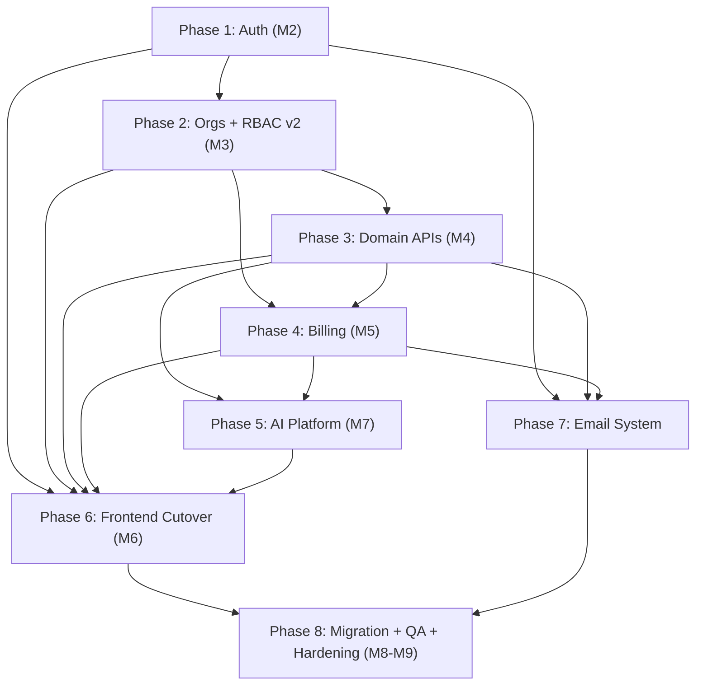

# BizPilot -- Final Implementation Plan

## Background

BizPilot is a mini-ERP SaaS for small businesses (invoicing, clients, inventory, expenses, reports, teams). The current system is a **Next.js 16 monolith on Supabase** with all business logic in React Server Components/Server Actions and authorization in Postgres RLS.

**Current state (from codebase inspection):**
- `backend/` -- Django 5 + DRF scaffolded via cookiecutter-django. **M1 Scaffold is done**: CI (ruff + mypy + pytest), Docker Compose (Postgres 16 + Redis + Mailpit), OpenAPI via drf-spectacular, Celery configured, `users` app with custom User model, django-unfold admin, i18n (English + Bangla).
- `invoive_generator-next/` -- The production Next.js 16 frontend (React 19, Supabase, Tailwind, shadcn/ui, Recharts). Fully functional for demo use with ~56% of requirements implemented, ~33% missing.
- `docs/` -- Four planning documents (SaaS Report, Django Migration Plan, QA Requirements Analysis, Subscription Management Plan).

**What needs to happen:** Complete the Django backend migration, build subscription/billing, implement RBAC v2, port AI features, cut the frontend over from Supabase to Django API, close all QA gaps, and ship a sellable SaaS product.

---

## User Review Required

> [!IMPORTANT]
> **Open Questions (from QA analysis)** -- These must be resolved before implementation begins for the affected components. Each question is tagged with the phase it blocks.
>
> - **Q1 (Phase 3):** When does an invoice become `overdue` -- computed on read (`due_date < today`) or by a scheduled job? What transitions cancel `overdue`?
> - **Q2 (Phase 3):** Invoice numbering -- strict gapless sequence (required in some jurisdictions) or best-effort? Reset counter each January?
> - **Q3 (Phase 3):** Can a payment exceed the invoice balance (creating credit)? Is there a refund flow?
> - **Q4 (Phase 3):** Mixed-currency orgs -- are dashboard totals summed naively, converted to org default currency, or filtered to one currency?
> - **Q5 (Phase 3):** Stock on invoice lines -- warn only or block sending? Deduct stock at send or at payment?
> - **Q6 (Phase 3):** What happens when a client with invoices is deleted -- block, anonymize, or cascade?
> - **Q7 (Phase 2):** Invite claim edge cases -- two orgs invite same email with different roles, both claimed? Invite expiry?
> - **Q8 (Phase 2):** Can multiple `owner`-role members exist? Ownership transfer flow?
> - **Q9 (Phase 4):** Downgrade over-limit behavior -- read-only or blocked writes? (Subscription Plan says read-only + blocked growth-writes; confirm)
> - **Q10 (Phase 3):** Is the anonymous create-invoice-without-login feature kept for SaaS?
> - **Q11 (Phase 6):** Target launch markets (defines invoice legality + data residency requirements)?
> - **Q12 (Phase 4):** Trial model -- 14-day Pro trial or freemium-with-limits? (Migration Plan says 14-day trial on upgrade; confirm)

> [!WARNING]
> **Breaking changes to be aware of:**
> - Auth will migrate from Supabase Auth to Django JWT -- users keep their passwords (bcrypt compatible) but the auth flow changes.
> - The `bp_active_org` cookie is replaced by URL-based org scoping (`/api/v1/orgs/{org_id}/...`).
> - All Server Actions and Supabase SDK calls in the frontend will be replaced by a generated typed API client.
> - RLS will be disabled as the primary gate once Django enforces org-scoping at the application layer.

---

## Open Questions

See "User Review Required" above. All 12 questions are documented with their blocking phases. Implementation of affected components will proceed with the recommended defaults from the Migration Plan unless you specify otherwise.

---

## Proposed Changes

The plan is organized into **8 phases** that map to the migration plan milestones (M1-M9). Phases are sequential with internal parallelism noted. M1 (Scaffold) is already complete.

---

### Phase 1: Authentication and User Management (Milestone M2)

**Goal:** Full auth parity with Supabase Auth via Django JWT. Dual-run capability so existing frontend continues working.

#### Backend (`backend/bizpilot/`)

##### [NEW] `accounts/` app
- Custom `User` model extending the existing `users/` app (already has custom User via cookiecutter)
- `Profile` model (port of Supabase `profiles` table: invoice defaults, company details)
- JWT endpoints via `djangorestframework-simplejwt`: signup, login, logout, token refresh
- Google OAuth via `django-allauth` (port of `auth/callback/route.ts`)
- Password reset/confirm flow
- `POST /api/v1/auth/signup` -- auto-create profile + personal organization (port of DB trigger)
- `POST /api/v1/auth/invites/claim/` -- port of `claimPendingInvites()` from `lib/erp/org.ts`
- `GET /api/v1/me` -- user + memberships + permissions
- `PATCH /api/v1/me/profile` -- profile editing

##### [MODIFY] `config/settings/base.py`
- Add `djangorestframework-simplejwt`, `django-allauth`, `django-cors-headers` to installed apps
- Configure JWT settings (access token lifetime, refresh rotation, httpOnly cookie fallback)

##### [NEW] `core/` app
- Base models (`TimestampedModel` with `created_at`, `updated_at`)
- Custom DRF exception handler (RFC 7807 error format)
- Base pagination (cursor-based)
- `AuditLog` model (who, what, org, before/after diff)
- Audit mixin for automatic logging on mutations

**Dependencies:** None (M1 done)

---

### Phase 2: Organizations and RBAC v2 (Milestone M3)

**Goal:** Full organization management with custom role/permission system replacing the fixed 4-role RLS ladder.

#### Backend (`backend/bizpilot/`)

##### [NEW] `orgs/` app

**Models:**
- `Organization` -- port of `public.organizations` (business profile, invoice defaults, `stripe_customer_id`)
- `Permission` -- fixed catalog of `resource.action` codenames (40+ permissions across invoices, clients, products, expenses, reports, team, organization, billing, ai, audit_log)
- `Role` -- org-scoped or system template (`is_system` flag); M2M to `Permission`
- `Membership` -- replaces `team_members`; M2M to `Role`; supports multiple roles per member
- `Invite` -- tokenized invites with expiry (upgrade over email-matching)

**Permission catalog (fixed, not org-editable):**

| Resource | Permissions |
|---|---|
| invoices | view, create, edit, delete, send, record_payment |
| clients | view, create, edit, delete |
| products | view, create, edit, delete, adjust_stock |
| expenses | view, create, edit, delete |
| reports | view, export |
| team | view, invite, manage_roles, remove |
| organization | view, edit_settings, delete |
| billing | view, manage |
| ai | use_assistant, generate |
| audit_log | view |

**System roles seeded per org:**
- `owner` -- all permissions
- `admin` -- all except `organization.delete`
- `editor` -- CRUD on operational data + `ai.*`
- `viewer` -- all `*.view` + `ai.use_assistant`

**Enforcement:**
- `OrgPermission` DRF permission class -- checks org from URL, active membership, required permission(s)
- `OrgScopedViewSet` -- queryset always filtered by `org_id` from URL (replaces RLS isolation)
- Redis-cached permission resolution per `(user, org)` with invalidation on role/membership change
- Every 403 returns the missing permission codename for UI messaging

**API:**
```
GET|POST        /api/v1/orgs/
GET|PATCH|DELETE /api/v1/orgs/{org_id}/
GET|POST        /api/v1/orgs/{org_id}/members/
PATCH|DELETE    /api/v1/orgs/{org_id}/members/{id}/
GET|POST        /api/v1/orgs/{org_id}/roles/
PATCH|DELETE    /api/v1/orgs/{org_id}/roles/{id}/
GET             /api/v1/orgs/{org_id}/permissions/
PATCH           /api/v1/orgs/{org_id}/members/{id}/roles/
GET             /api/v1/me/permissions/?org={org_id}
```

Custom role CRUD is gated behind the `custom_roles` entitlement (Enterprise plan only).

**Dependencies:** Phase 1 (accounts/auth must exist for membership)

---

### Phase 3: Domain APIs -- ERP Core (Milestone M4)

**Goal:** Port all business logic from Next.js Server Actions and Supabase queries to Django REST endpoints. This is the largest phase.

#### Backend (`backend/bizpilot/`)

##### [NEW] `erp/` app (package with sub-modules)

**Models (port of Supabase tables, UUID PKs preserved):**
- `Client` -- name, email, phone, address, company, `is_active`, `organization_id`
- `Product` -- name, description, price, currency, category, unit, SKU, `stock_quantity`, `low_stock_threshold`, `track_stock`, `is_active`
- `Invoice` -- client FK, number (`INV-YYYY-NNN`), status (draft/pending/paid/overdue/cancelled), subtotal, tax, discount, total, currency, due_date, notes, terms
- `InvoiceItem` -- invoice FK, product FK (nullable), description, quantity, unit_price, total
- `Payment` -- invoice FK, amount, date, method (Cash/Card/Bank Transfer/Mobile Money/Other), reference, notes
- `Expense` -- category (9 types), vendor, amount, date, payment_method, description, notes

**Service layer (thin ViewSets, business rules in `services.py`):**
- Invoice number generation: per-org sequence with `select_for_update` (behavior per Q2 answer)
- Stock deduction on invoice send, restore on cancel (per Q5 answer)
- Payment auto-settle: `status=paid` when sum(payments) >= invoice total
- Low-stock warnings when line item qty > `stock_quantity`
- Delete cascades matching current FK behavior

**New capabilities (closing SaaS Report gaps #4-#8):**
- Client edit form/endpoint (Report #4)
- Product edit form/endpoint (Report #5)
- Expense edit form/endpoint (Report #6)
- Invoice edit after creation (Report #7)
- Delete confirmation support -- no silent deletes (Report #8)

**API:**
```
CRUD  /api/v1/orgs/{org_id}/clients/
GET   /api/v1/orgs/{org_id}/clients/{id}/stats/
CRUD  /api/v1/orgs/{org_id}/products/
POST  /api/v1/orgs/{org_id}/products/{id}/adjust-stock/
CRUD  /api/v1/orgs/{org_id}/invoices/
POST  /api/v1/orgs/{org_id}/invoices/{id}/payments/
POST  /api/v1/orgs/{org_id}/invoices/{id}/mark-paid/
POST  /api/v1/orgs/{org_id}/invoices/{id}/pdf/
CRUD  /api/v1/orgs/{org_id}/expenses/
```

##### [NEW] `reports/` app
- Dashboard stats endpoint (revenue, outstanding, expenses, clients, counts)
- Monthly trends (6-month series)
- Revenue vs Expense report with 12-month series
- Expense by category breakdown
- Top clients by invoiced amount
- Global search (org-scoped -- fixes Report bug #9)

**API:**
```
GET   /api/v1/orgs/{org_id}/dashboard/
GET   /api/v1/orgs/{org_id}/reports/
GET   /api/v1/orgs/{org_id}/search/?q=...
```

**Dependencies:** Phase 2 (org-scoping and permissions must be in place)

---

### Phase 4: Billing and Subscription Management (Milestone M5)

**Goal:** Full Stripe integration with plan enforcement, usage metering, trials, and dunning. This is the monetization foundation.

#### Backend (`backend/bizpilot/billing/`)

##### [NEW] `billing/` app

**Models:**
- `Plan` -- code (free/pro/enterprise), name, `stripe_product_id`, tier (0/1/2), `trial_days` (14), `is_active`
- `PlanEntitlement` -- plan FK, key (from catalog), value (JSONField: int/bool/list)
- `Subscription` -- organization OneToOne, plan FK, Stripe IDs, status (trialing/active/past_due/canceled/incomplete/paused), trial fields, period fields, `cancel_at_period_end`, `pending_plan`
- `PriceMapping` -- `stripe_price_id` -> plan + interval (month/year)
- `UsageCounter` -- org FK, key, `period_start`, count
- `StripeEvent` -- idempotency table (`stripe_event_id` unique)

**Entitlement catalog:**

| Key | Free | Pro | Enterprise |
|---|---|---|---|
| `max_invoices_per_month` | 10 | 500 | unlimited |
| `max_clients` | 5 | 200 | unlimited |
| `max_products` | 10 | 1000 | unlimited |
| `max_team_members` | 1 | 10 | unlimited |
| `max_organizations` | 1 | 3 | unlimited |
| `ai_credits_per_month` | 25 | 500 | 5000 |
| `recurring_invoices` | false | true | true |
| `email_invoice_delivery` | false | true | true |
| `client_portal` | false | true | true |
| `data_export` | false | true | true |
| `custom_roles` | false | false | true |
| `audit_log` | false | true | true |

**Engine (`engine.py`):**
- `allow(org, key)` -- bool feature check, raises `FeatureNotAvailable` (403)
- `enforce(org, key)` -- int cap check, raises `PlanLimitExceeded` (402 with upgrade hint)
- `meter(org, key)` -- Redis INCR after successful action
- `usage_summary(org)` -- for UI: `{key: {used, cap}}`
- Redis-cached entitlements (60s TTL), cold-start reseeding from Postgres

**Stripe lifecycle:**
- Signup creates Free subscription (no Stripe involvement)
- Upgrade via `POST /api/v1/billing/checkout/` -> Stripe Checkout Session
- Webhook handler (`POST /api/v1/billing/webhooks/stripe/`): signature verify, StripeEvent idempotency, Celery dispatch
- Events handled: `checkout.session.completed`, `customer.subscription.created|updated|deleted`, `invoice.paid`, `invoice.payment_failed`
- Mid-cycle upgrade: immediate via Stripe proration
- Mid-cycle downgrade: scheduled for period end via `pending_plan`
- Cancellation via Customer Portal; access until `current_period_end`
- Dunning: 3 retries, then soft-lock writes (reads stay open)
- Downgrade: never delete data, over-limit becomes read-only for growth-writes

**Enforcement points wired into Phase 3 services:**
1. Invoice create (monthly cap)
2. Client/product create (total cap)
3. Invite member (`max_team_members`)
4. Create org (`max_organizations`)
5. AI endpoints (credits, wired in Phase 5)

**Rollout:**
1. Ship models + engine with `BILLING_ENFORCEMENT=False` (dark launch)
2. Enable for new orgs only (feature flag by `created_at`)
3. Enable globally after parallel-run validation

**API:**
```
POST  /api/v1/billing/checkout/
POST  /api/v1/billing/portal/
GET   /api/v1/orgs/{org_id}/subscription/
POST  /api/v1/billing/webhooks/stripe/
GET   /api/v1/billing/plans/
```

**Dependencies:** Phase 2 (orgs), Phase 3 (services to wire enforcement into)

---

### Phase 5: AI Platform (Milestone M7-M8)

**Goal:** Port existing AI features to Django with a provider-agnostic gateway, add usage metering, and deliver the first wave of new AI capabilities.

#### Backend (`backend/bizpilot/`)

##### [NEW] `ai/` app

**AI Gateway:**
- `LLMProvider` protocol with `complete()` method
- `OpenRouterProvider` -- port of `lib/ai/openrouter.ts` with free-model fallback chain
- `OpenAIProvider` -- for paid tiers / embeddings
- Response caching in Redis (hash of prompt + model)
- Per-org quota enforcement via billing engine (`ai_credits_per_month`)
- Per-user rate limiting
- Usage logging: org, user, feature, model, tokens in/out, latency, cost estimate
- SSE streaming for chat features
- Structured output validation via Pydantic schemas

**Port of existing features:**
- `POST /api/v1/orgs/{id}/ai/generate-items/` -- AI invoice line-item generation (perm: `ai.generate`)
- `POST /api/v1/orgs/{id}/ai/assistant/` -- BizPilot business Q&A + SSE streaming (perm: `ai.use_assistant`)

**New AI features (wave 1):**
- Expense auto-categorization (suggest category/vendor from title + notes)
- Payment reminder email drafting (tone-controlled per invoice)
- Natural-language report answers (extends BizPilot assistant with chart-attached responses)
- Receipt/invoice OCR ingestion (photo/PDF to expense or invoice draft via vision model)

**AI governance:**
- Quota metering per feature (weights configurable per plan)
- Usage surfaced to admins in billing page
- Model pinning per feature via settings (cheap models for classification, stronger for assistant)
- Feature flags per plan via entitlement mechanism
- Prompt-injection defense: org data injected as structured JSON, never raw user text in system prompts

**Dependencies:** Phase 3 (domain models for context), Phase 4 (credit metering)

---

### Phase 6: Frontend Cutover (Milestone M6)

**Goal:** Replace all Supabase SDK and Server Action calls in the Next.js frontend with the Django API client.

#### Frontend (`invoive_generator-next/`)

##### [NEW] `lib/api/` -- Generated typed API client
- Generate from OpenAPI schema (`drf-spectacular` -> `openapi-typescript` + `openapi-fetch`)
- Replace `lib/erp/types.ts` with generated types

##### [MODIFY] Auth layer
- New auth provider storing JWT access token in memory + refresh in httpOnly cookie
- Global 401 -> refresh -> retry interceptor
- Replace Supabase Auth hooks

##### [MODIFY] Data layer (page by page)
- Replace `lib/erp/queries.ts` Supabase calls with API client
- Replace `app/(dashboard)/actions.ts` Server Actions with client-side mutations
- Replace `actions/stripe.ts` with `/api/v1/billing/*`
- Replace `ai-actions.ts` with `/api/v1/orgs/{id}/ai/*` (add streaming UI for assistant)

##### [MODIFY] Org switching
- Replace `bp_active_org` cookie with client-side org context feeding `{org_id}` URLs

##### [MODIFY] Permission gating
- Replace `lib/erp/org.ts` (`requireRole`, `roleAtLeast`) with `usePermissions()` hook
- Feed from `/api/v1/me/permissions/`
- UI gating becomes capability-based (`can("invoices.create")`) instead of rank-based

##### [NEW] UX improvements (closing SaaS Report gaps)
- Client edit form/page (Report #4)
- Product edit form/page (Report #5)
- Expense edit form/page (Report #6)
- Invoice edit capability (Report #7)
- Delete confirmation dialogs for invoices, clients, products, expenses (Report #8)
- Loading states for all async operations
- Toast notifications for all actions
- Error boundaries for graceful error handling
- Upgrade prompt modal triggered by 402 responses

##### Untouched
- Marketing/legal pages (`/`, `/pricing`, `/terms`, etc.) stay server-rendered in Next.js

##### [DELETE] (after full cutover)
- `lib/supabase/*`
- `lib/erp/org.ts` role helpers
- Cookie-based org switching code

**Dependencies:** Phase 1-5 (API must be serving all endpoints)

---

### Phase 7: Email System and Transactional Notifications

**Goal:** Implement all transactional email flows required for a sellable product.

#### Backend (`backend/bizpilot/`)

##### [NEW] `notifications/` (or integrate into existing apps)

**Email provider:** `django-anymail` with Resend or AWS SES

**Email flows:**
- Welcome email on signup
- Team invite emails with tokenized link (replaces manual share -- Report #11 critical gap)
- Invoice delivery emails with PDF attachment (Report #3)
- Payment confirmation emails
- Password reset emails (branded, port from Supabase)
- Subscription confirmation/receipt emails
- Dunning emails (payment failed, retries, soft-lock warning)

**Email templates:** BizPilot-branded HTML templates with:
- Unsubscribe footer (CAN-SPAM compliance)
- SPF/DKIM/DMARC configured on sender domain

**Celery tasks:** All emails sent asynchronously via Celery to avoid blocking API responses.

**Dependencies:** Phase 1 (auth), Phase 3 (invoices/payments), Phase 4 (billing events)

---

### Phase 8: Data Migration, QA, and Production Hardening (Milestone M8-M9)

**Goal:** Migrate all data from Supabase to Django, close all QA gaps, and prepare for production launch.

#### 8A: Data Migration

##### [NEW] Migration scripts
- Schema: Django models via `inspectdb` as starting point, then normalized (team_members -> memberships + membership_roles)
- Data: `pg_dump`/copy per table; UUID PKs preserved
- Auth: `auth.users` -> `accounts_user` (bcrypt hashes compatible -- no password reset needed)
- Backfill: old `team_members.role` column -> seeded system Roles + `membership.roles` M2M
- Verification: row-count + checksum reconciliation script per table
- Parallel-run: report queries diffed between old and new systems before cutover

##### Auth cutover
- Issue JWTs from Django behind same domain
- Dual-session window (Supabase + Django both valid)
- Staged rollout: 5% -> 25% -> 100% behind feature flag
- Retire Supabase Auth keys after confirmation

##### RLS
- Disabled once all reads/writes go through Django
- Kept as defense-in-depth for any residual direct DB access

---

#### 8B: QA and Testing (closing gaps from QA Requirements Analysis)

##### [NEW] Test suites

**P0 -- Must exist before launch:**

| Suite | What it covers |
|---|---|
| Unit tests (pytest) | Money math, invoice numbering, payment balances, auto-settle, permission matrix |
| Cross-tenant security suite | Every endpoint tested with non-member user -> 404/403 |
| RBAC matrix test | 4 system roles x every action, at Django service layer level |
| Billing tests | Webhook idempotency, out-of-order events, duplicate delivery, plan enforcement gates |
| CI pipeline | ruff + mypy + pytest + coverage gate on every PR (already scaffolded in M1) |

**P1 -- Should exist before launch:**

| Suite | What it covers |
|---|---|
| API contract tests | Every endpoint request/response validated against OpenAPI schema |
| Visual/PDF regression | Invoice PDF fidelity (currency symbols, page breaks, layout) |
| Multi-browser E2E | Playwright multi-project: Chromium + Firefox + WebKit + mobile viewport |
| Data migration verification | Row-count + checksum reconciliation + parallel-run report diffing |

**P2 -- Post-launch:**

| Suite | What it covers |
|---|---|
| Accessibility (axe-core) | WCAG 2.1 AA on dashboard flows |
| Performance (k6) | Dashboard p95 < 2s with 10k invoices/org |
| i18n verification | Locale handling, date formatting |

**Requirement defects to fix (from QA D-01 to D-07):**
- D-01: Update README version string (Next.js 15 -> 16.1.1)
- D-02: Update README to reflect Stripe integration exists
- D-03: Implement or correct stock auto-deduction claim
- D-04: Hide "Send invoice by email" button until email system ships
- D-05: Fix global search org-scoping bug + regression test
- D-06: Write behavior specs for: invoice numbering rollover, overdue transitions, overpayment, client deletion with invoices
- D-07: Dedicated test fixtures + teardown; never seed demo creds in prod

---

#### 8C: Security Hardening

- Rate limiting on auth endpoints (`django-ratelimit` + Redis)
- Rate limiting on API/server actions (per-user and per-org buckets)
- Security headers: CSP, HSTS, X-Frame-Options
- Input validation audit (DRF serializer Zod equivalent)
- CSRF protection audit
- Dependency vulnerability scanning (Dependabot already configured)
- `NEXT_PUBLIC_` env var audit (no secrets in client bundle)
- Secrets management verification (no hardcoded keys)

---

#### 8D: Production Infrastructure

- Deploy Django to production (Vercel for frontend, Railway/Fly.io for backend)
- Custom domain setup with SSL
- Supabase production project (separate from dev) or dedicated Postgres
- Database backups configured (daily, RPO <= 24h)
- Redis for rate limiting + caching (Upstash)
- Sentry error tracking (Python + JS)
- Uptime monitoring
- Log aggregation
- CDN for static assets

---

## Dependency Graph (Phase Order)



**Parallelism:** Phase 7 (Email) can be developed in parallel with Phases 3-5 once Phase 1 is done. Phase 4 (Billing) can start once Phase 2 is complete and progress alongside Phase 3.

---

## Verification Plan

### Automated Tests

```bash
# Backend unit + integration tests (run on every PR via GitHub Actions)
cd backend && uv run pytest --cov=bizpilot --cov-fail-under=80

# Billing module -- stricter coverage gate
cd backend && uv run pytest bizpilot/billing/ --cov=bizpilot/billing --cov-fail-under=100

# Lint + type check (already in CI)
cd backend && uv run ruff check . && uv run mypy .

# E2E tests (Playwright, multi-browser)
cd invoive_generator-next && npx playwright test --project=chromium --project=firefox --project=webkit

# Data migration verification
cd backend && uv run python scripts/verify_migration.py  # row-count + checksum reconciliation
```

### Manual Verification

- Full signup-to-first-invoice flow tested on staging
- Stripe Checkout/Portal tested with Stripe test mode
- Webhook replay via Stripe CLI (`stripe listen --forward-to`)
- Cross-tenant isolation tested with multiple test users across orgs
- Downgrade/upgrade flows verified with Stripe test clocks
- PDF export visual inspection across currencies
- Mobile responsive testing on 360px viewport
- Team invite flow end-to-end (email receipt, claim, role assignment)

### Release Exit Criteria (from QA analysis)

- 100% of **Must** requirements implemented and acceptance criteria pass
- 0 open Critical/High defects
- Cross-tenant isolation (NFR-SEC-01/02) verified
- Monetary arithmetic integrity (NFR-DATA-01) verified
- CI pipeline running (NFR-MAINT-01) verified
- Plan enforcement (FR-BILL-05) + invite email (FR-TEAM-11) + delete confirmations (FR-INV-13) shipped
- All documentation defects (D-01 through D-07) resolved
- E2E green on 3 browsers in CI on staging
